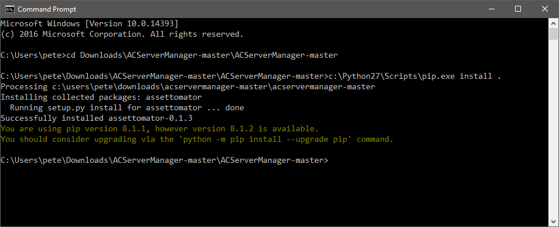
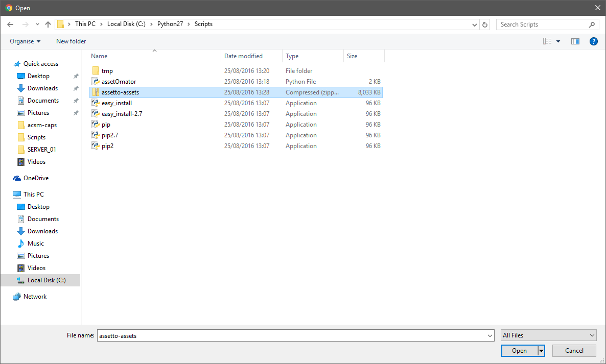

************************
assetOmator Installation
************************
The assetOmator tool is a Python script which inspects your PCs Assetto Corsa installation for assets such as the cars
and tracks you have installed - official DLC and community mods, and bundles the necessary files into a zip archive.  It
also builds "fixtures" which populate the Assetto Corsa Server Manager database - again, this comes from the cars and
tracks data you have installed.  It also bundles in the "Asetto Corsa Dedicated Server" which should should have
installed already through Steam.

Since the assetOmator is written in Python, which is not native to Windows, that requires you to first install Python
(which is free) and then the assetOmator script.

Python for Windows Installation
-------------------------------
Install python - the official Windows download page can be found here: `Python for Windows`_

.. _Python for Windows: https://www.python.org/downloads/windows/

Choose the "Latest **Python2.x** Release" NOT Python3.x.

That should bring you to a page with various download links - choose the "Windows MSI Installer" that matches your
system (if in doubt choose the x86-64 version).

Once downloaded, run the installer and you'll be prompted to answer questions regarding install paths etc - accept the defaults.

assetOmator Installation
------------------------
With Python for Windows installed, download a zip archive of the Assetto Corsa Server Manager project from here: `ACServerManager Zip`_

.. _ACServerManager Zip: https://github.com/PeteTheAutomator/ACServerManager/archive/master.zip

Locate the downloaded zip file using File Explorer (I'm assuming it's in "Downloads"), right click it and choose "extract all".

Now for a little bit of command-line fun - click the Windows/Start button and run "cmd" to bring up a terminal

Then within the terminal, using the "cd" command, change directory into the extracted zip file...

.. code::

    cd Downloads\ACServerManager-master\ACServerManager-master

Then run a Python tool called "pip.exe" to install assetOmator.

pip.exe is located in c:\\Python27\\Scripts by default - this is what you'd type - don't forget the dot; type exactly the following...

.. code::

    c:\Python27\Scripts\pip.exe install .

Here's how that should look..

Enough command-line fun - you can close the terminal window.

assetOmator Usage
-----------------
Using File Explorer, navigate to c:\\Python27\\Scripts and you should find "assetOmator" in there.

Double-click "assetoOmator" and you'll should see a small window open up.  It may prompt you for Steam's location, and
after a short pause, you'll see a stream of text fly by saying "archiving files".  The window will close and and you
should see a zip file in the Scripts folder called "assetto-assets" - this is the file you'll need to upload to the server
using the Web Interface detailed in the next section.

