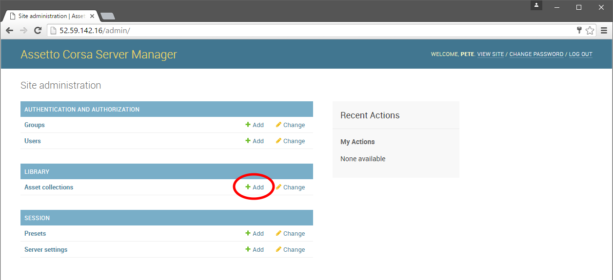
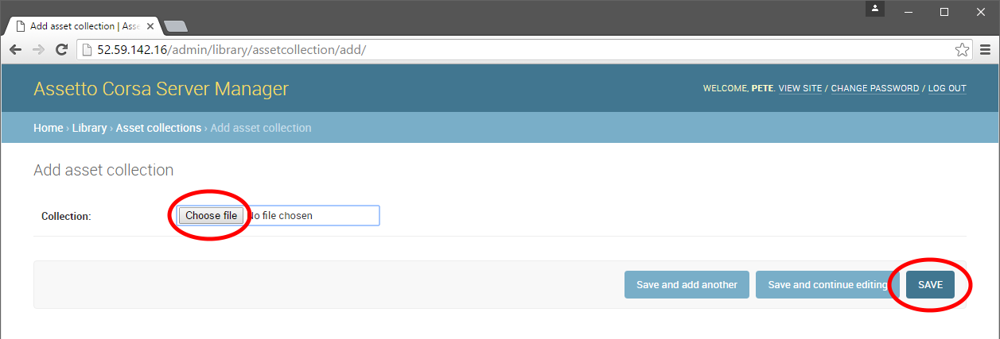
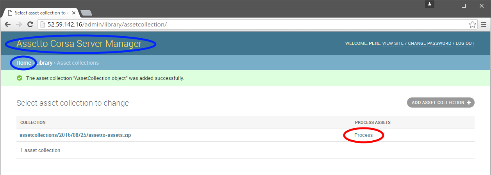
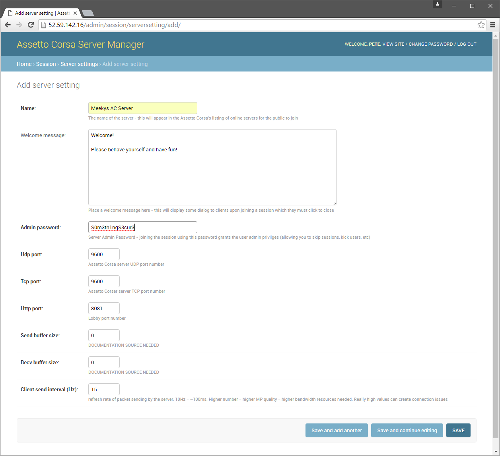
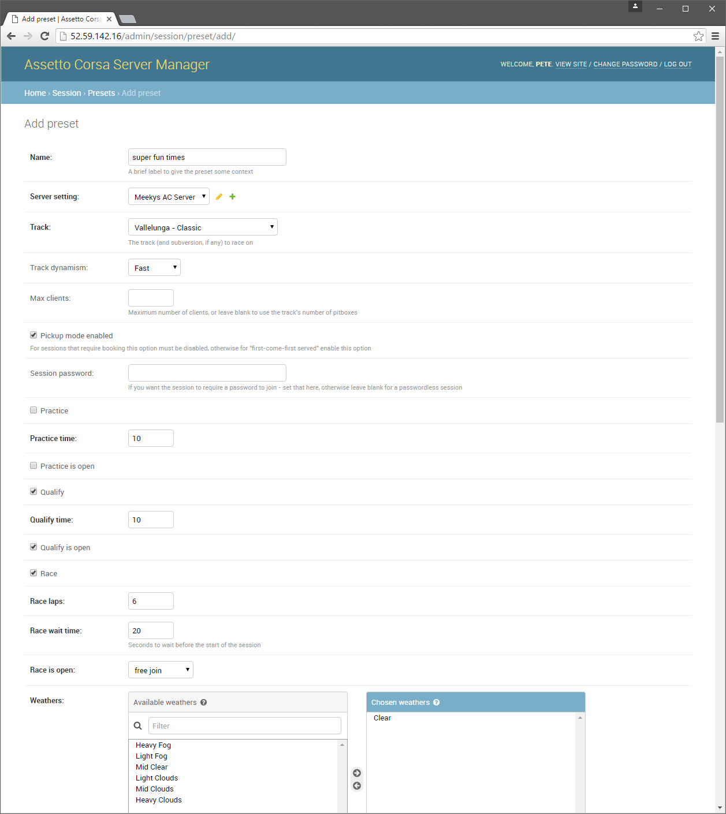
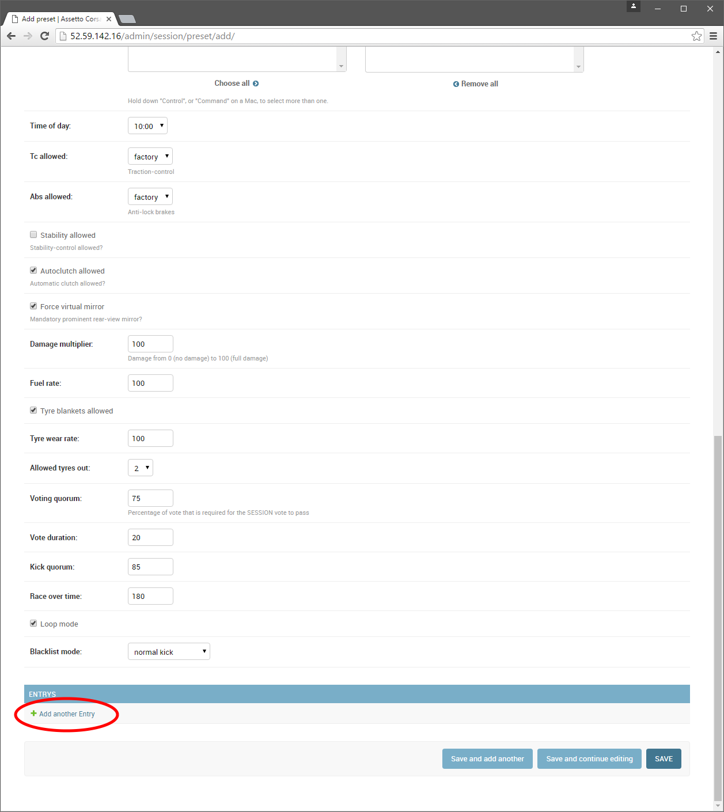
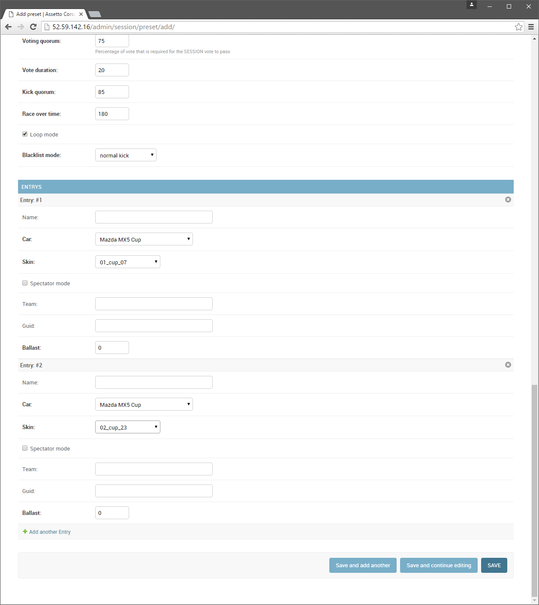
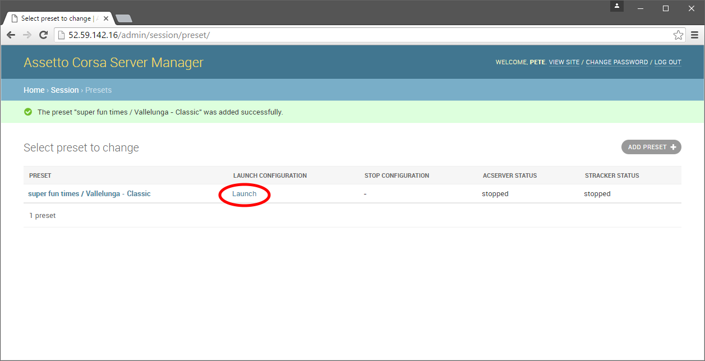
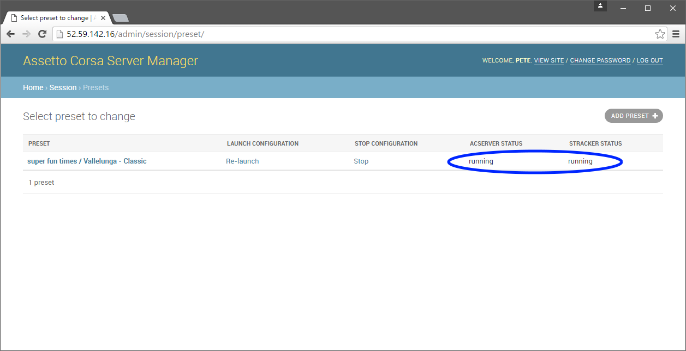

********************
Server Configuration
********************
At this point you should have your Assetto Corsa Server Manager running and an assetto-assets.zip archive ready to upload.

Log into your server's web interface, and you should been taken to the main menu shown in the screenshot below.  Under the
"Library" section click the "Add" button next to "Asset Collections"

Click on the "Browse" button and navigate to the folder where you stored assetto-asset.zip (probaby c:\Python27\Scripts)
and select the zip file, then click save - it should take a few moments to upload (depending on your internet connection).

When assetto-asset.zip is uploaded to the server you should be presented with this view - click the "Process" button; the
server will process the archive - extracting assets and loading the database.  (note: at time of writing, the processing
happens in the background very quickly and gives no comforting feedback, but it should work just fine)

Navigate back to the main menu by clicking either the "Home" link or the "Assetto Corsa Server Manager" title highlighted
blue in the screenshot above.

Server Settings
---------------
Your server should now be in a "pre-configured" state; on to defining it's name (which will appear in the Assetto Corsa
game's Online Server listing) and welcome message.

From the main menu, under the "SESSION" heading, click on "Server settings", and Add a new Server Setting.  Most of the
options you'll see can be left at their default values (such as TCP ports) - the only fields you **must** change at this
point are **Name** and **Admin password**.  Set a welcome message too if you like - this will appear when guests join
your server.

Click the save button when you're done and then move onto defining your first Session Preset.

Session Presets
---------------
From the main menu, add a new Preset (which you can find under the SESSION section).  Preset options are fairly lengthy;
mandatory fields have a **bold label**, pre-populated fields have sensible values, if you miss a required field you'll be
notified when you click save so read the help-text on the page to get an idea of what each option does.

As you scroll towards the bottom of the Preset page, notice the "Add another entry" link.  **Your session must contain at
least one Entry** in order to join - an Entry is essentially a Racer.

If you're hosting open sessions you'll only want to update an Entry's **Car** and **Skin** values; Name and Guid fields
are applicable if you've pre-booking users with known Steam IDs.

Once you're done defining your Preset and you've added Entries, click Save and you should be brought to your Preset
listing which has controls allowing you to Launch or Stop the session.

Click the Launch button...

...and you should see the ACSERVER and STRACKER statuses change from stopped to running...

Now launch your Assetto Corsa game and find your server in the Online Servers list!  **TIP:** make sure you're not
filtering-out empty servers :)
