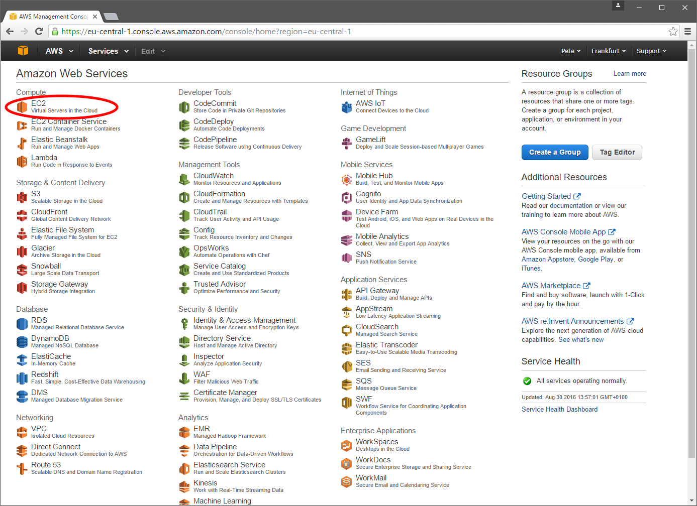
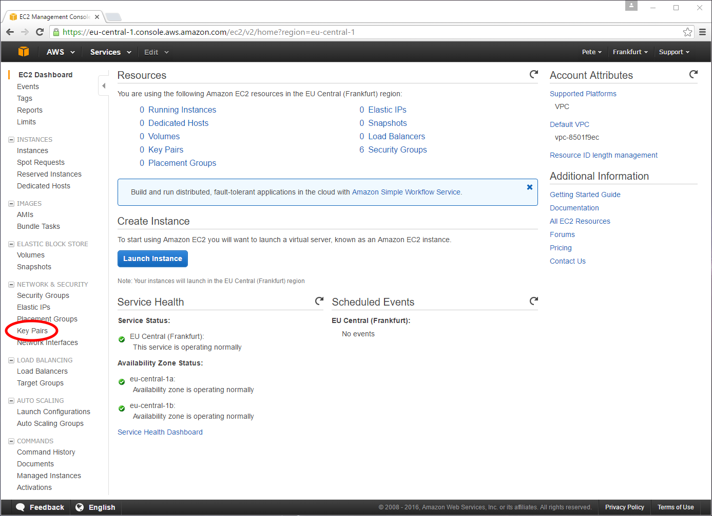
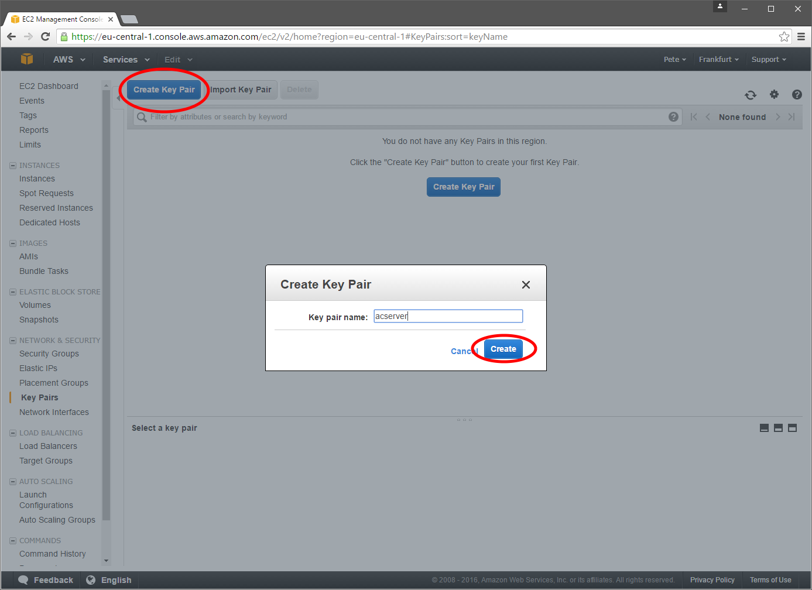
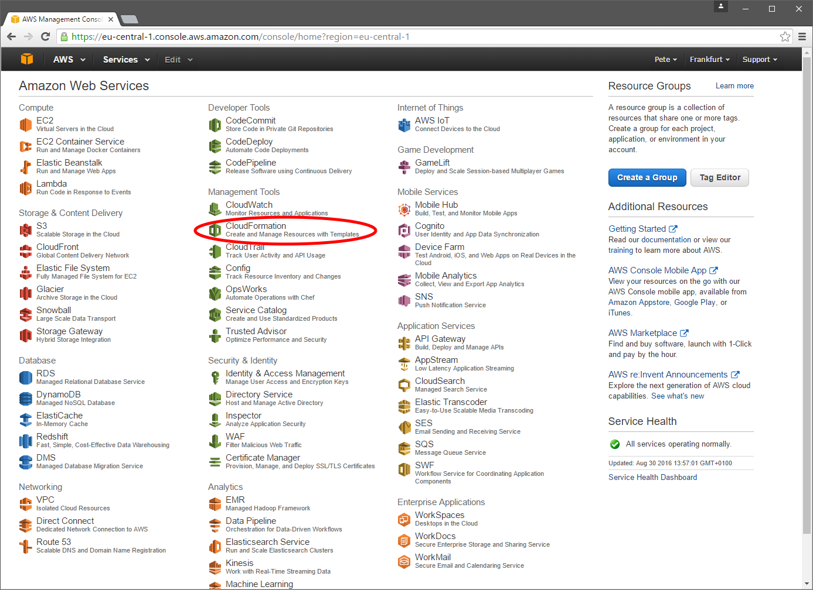
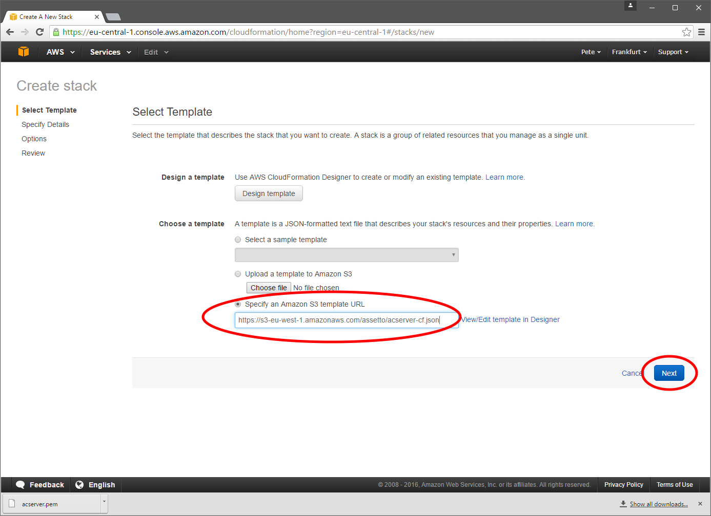
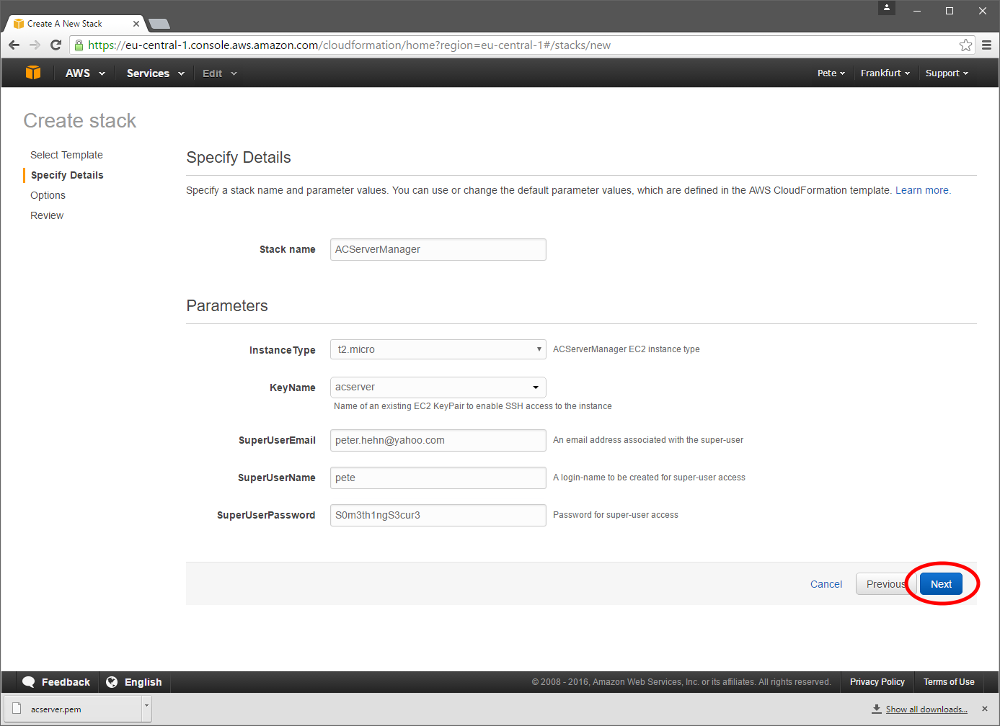
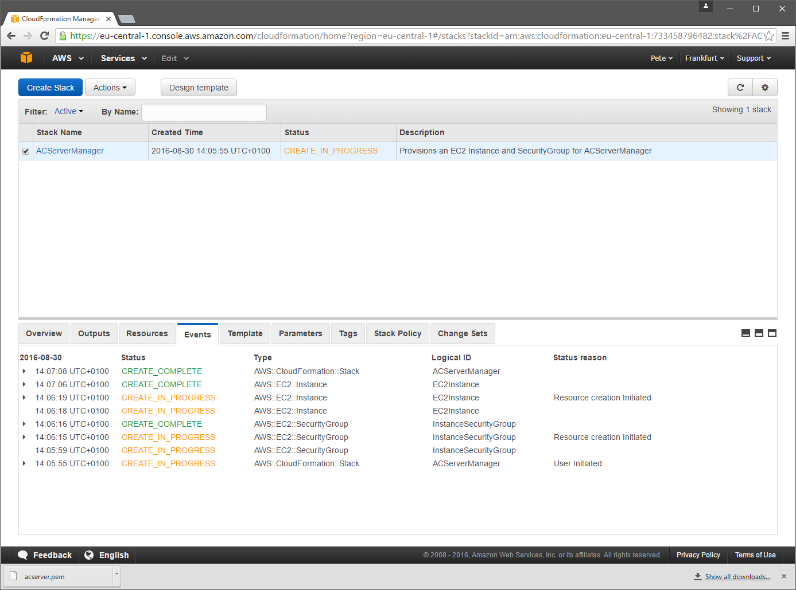
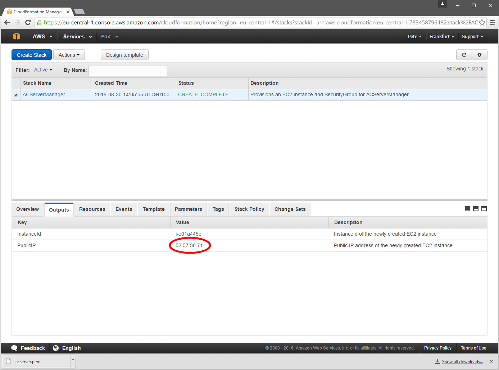
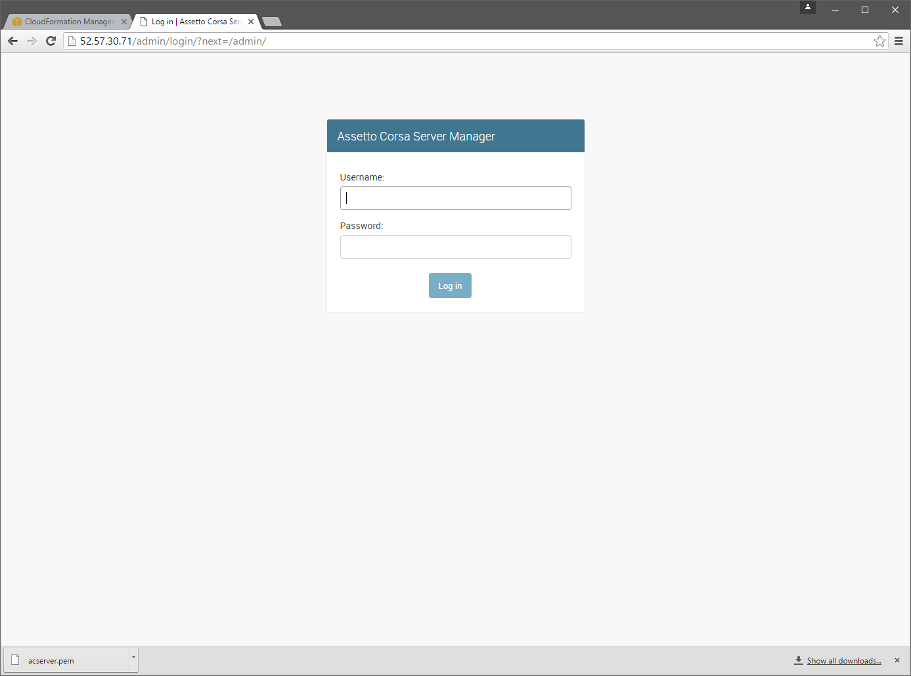
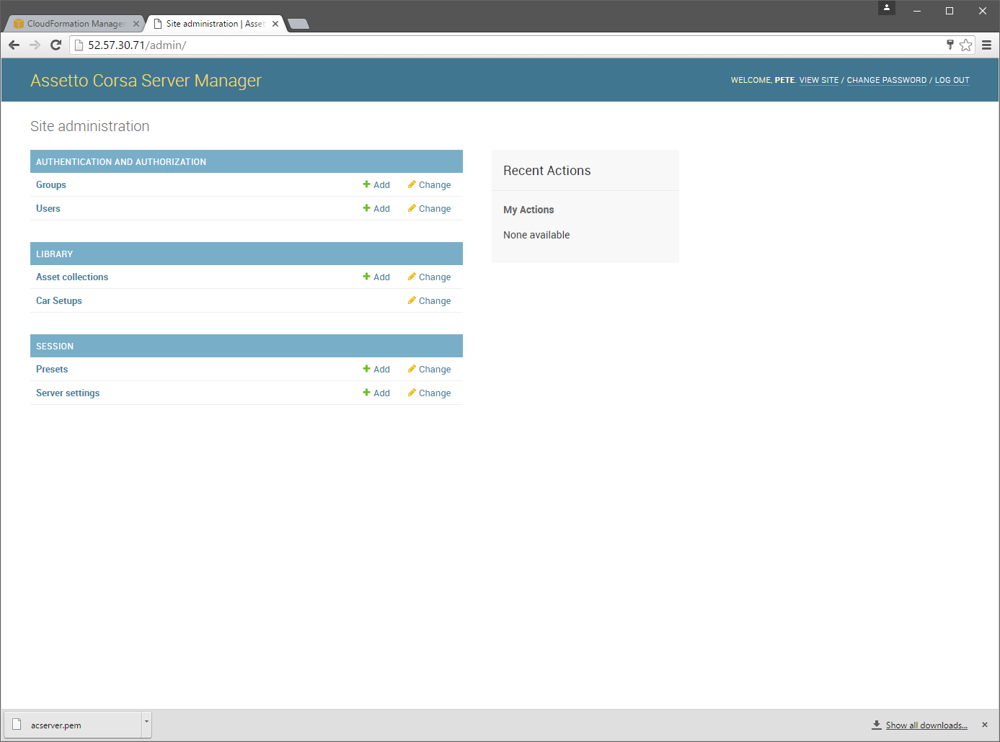

*********************************************************
Server Installation - Recommended Method (CloudFormation)
*********************************************************
First, sign-up for an `Amazon Web Services (AWS)`_ account.

.. _Amazon Web Services (AWS): https://aws.amazon.com

Once you have an AWS account, sign-into the AWS console and select a Region that's closes in proximity to you and your
fellow racers; Regions can be found in the drop-down list at the top-right of the console.

You should see a plethora of cloudy offerings - click "EC2" (Virtual Servers in the Cloud) at the top-left.

First you'll need to create a "Key Pair"; this provides you secure access to your server (via a program called SSH - which
stands for Secure Shell).  You will need this key to apply future software updates to your Assetto Corsa server.

Click the "Key Pairs" menu item

Then click the blue "Create Key Pair button" at the top-left of the next page.  Name your Key Pair something meaninful
like "assetto-corsa", click the "Download Key Pair" button and keep the downloaded file somewhere safe.

Return to the main-menu and find the "CloudFormation" option.

Click the blue "Create Stack" button at the top-left of the page and you should be taken to the screen shown below.

Tick the checkbox next to the option that reads "Specify an Amazon S3 template URL", and copy the following line of text
and paste it into the text field...

.. code::

   https://s3-eu-west-1.amazonaws.com/assetto/acserver-cf.json

After clicking the blue "Next" button you should be taken to a page which requires a few details about how to configure
your new Assetto Corsa Server Manager machine...

* **Stack name** is some arbitrary name for the CloudFormation Stack - "assetto" will do
* **InstanceType** is the specification of the server - the default "t2.micro" will do
* **KeyName** is the name of the Key Pair you created earlier
* **SuperUserEmail** is an email address you may wish to be contacted at (this is not used at the moment; perhaps a future feature may make use of it for sending alerts and such)
* **SuperUserName** is the name you wish to use to log-into the Assetto Corsa Server Manager
* **SuperUserPassword** is the password you wish to use to log-in.  The password must be a reasonably complex password, containing at least 1 upper-case and at least 1 numeric character. Remember - the login box is open to the world, so choosing a password that's hard to crack is definitely worthwhile.

You can safely click the blue "Next" button to skip over the next two screens; the first asks whether you want to apply
Tags to your CloudFormation Stack, and the second reviews your options before creating the stack.  Click the blue "Create"
button at the bottom right of the page and you should be taken to a screen which displays the progress of your Stack creation.

You may need to refresh the page a few times until the Status reads "CREATE_COMPLETE".

When your Stack creation is complete, it will take a few minutes more until your Assetto Corsa Server Manager has finished
installing - **this usually takes around 5 minutes**.

Click on the "Outputs" tab and you should find details of your server's IP address.

Copy the Public IP Address value and paste it into your browser's URL bar; if the server installation has finished you'll
see a login screen like the one below.  *Until it's finished installing you may see errors or nothing at all*

Enter the SuperUserName you set and the SuperUserPassword and you should successfully log-in and see the following page...

Congratulations!  Please continue onto the next section - :doc:`assetOmator_installation`