*****************************************
Server Installation - Manual Method (EC2)
*****************************************
First, sign-up for an `Amazon Web Services (AWS)`_ account.

.. _Amazon Web Services (AWS): https://aws.amazon.com

Once you have an AWS account, sign-into the AWS console and select a Region that's closes in proximity to you and your
fellow racers; Regions can be found in the drop-down list at the top-right of the console.

You should see a plethora of cloudy offerings - click "EC2" (Virtual Servers in the Cloud) at the top-left.

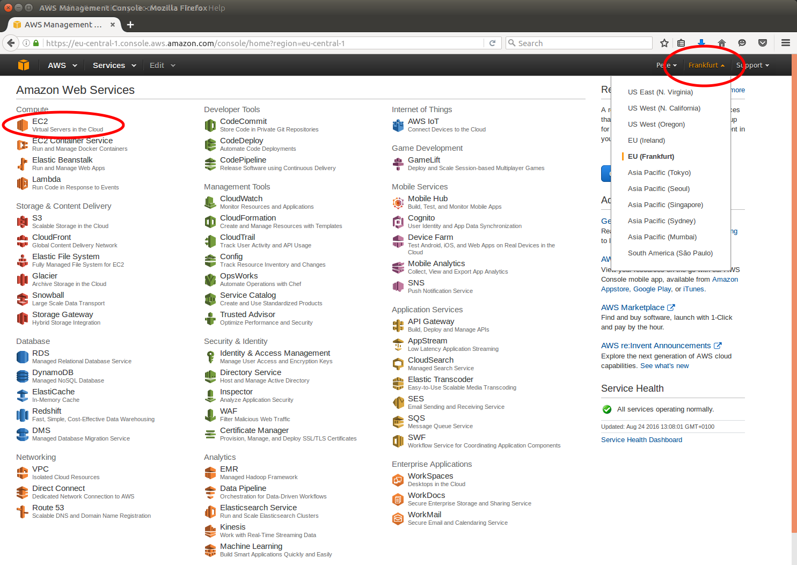

In the centre of the screen you should see a blue button labelled "Lanuch Instance" - click it.

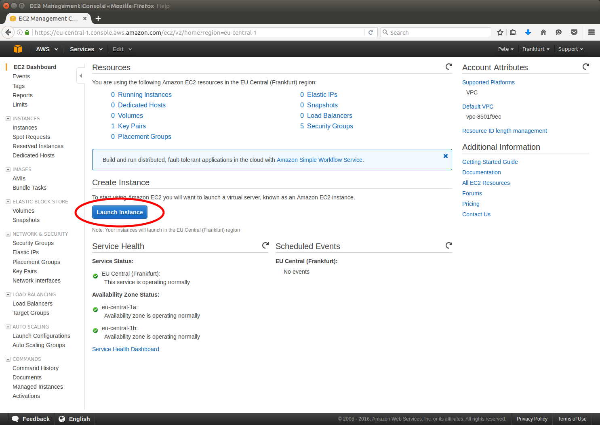

Next you'll see a bunch of Operating Systems to choose from - the one you want is "Red Hat Enterprise 7.x" and notice
the box beneath the RedHat logo that reads "Free tier available".

Hit its blue "Select" button on the right.

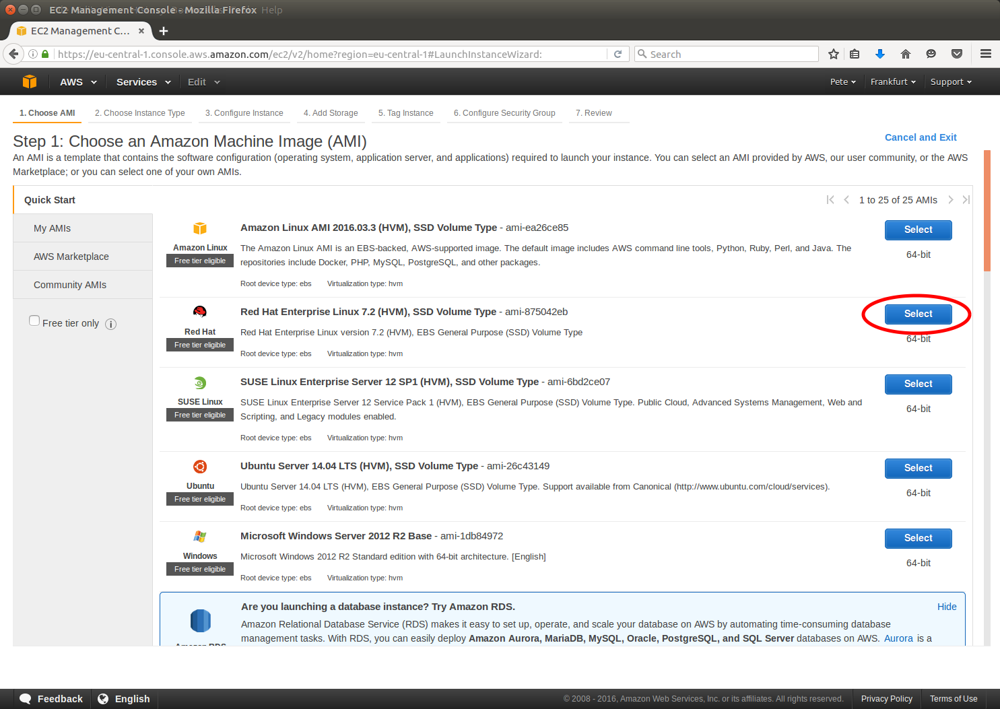

By default the selected Instance Type should be "t2.micro" and on it you should see a green box that reads "Free tier
eligable".  With this Instance Type selected, click the grey button labelled "Next: Configure Instance Details" button
at the bottom-right of the page **NOT** the blue launch button.

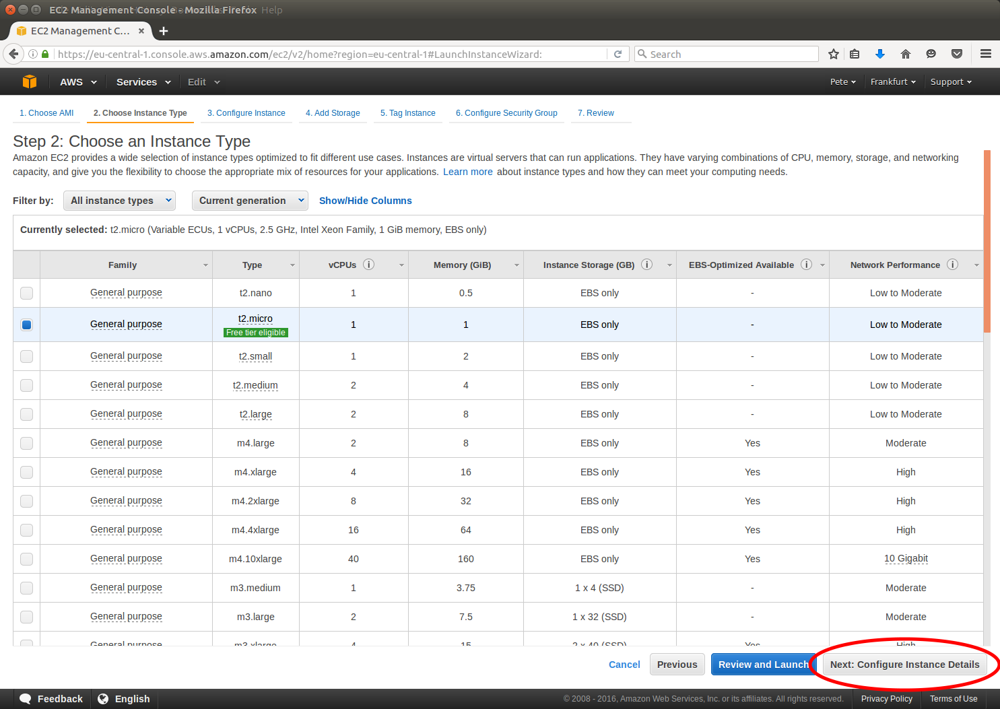

On the next page we need to set some variables and place a reference to an Bootstrap Script which the EC2 Instance will
execute shortly after it boots-up.  This Bootstrap Script will install some prerequisite software packages in order to
install the Assetto Corsa Server Manager.

Expand the arrow within the "Advanced Details" section.

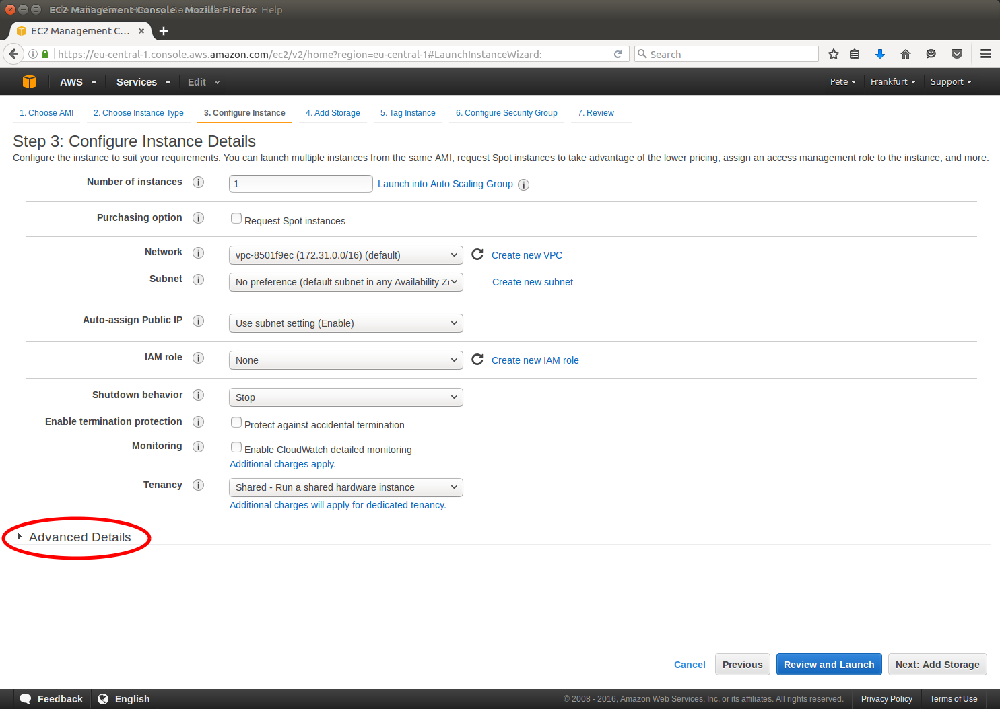

With the "Advanced Details" pane expanded you should see a text-area field into which you can paste those variables and
the reference to the Bootstrap Script.  BEFORE YOU DO - have a think about those variables; you'll see **NAME**,
**EMAIL** and **PASS**

* **NAME** - should be a login name that you want to use as a "super-user"
* **EMAIL** - should be an email address that the server can notify the "super-user" (perhaps some feature for the future)
* **PASS** - should be a fairly complex password, containing at least 1 upper-case and at least 1 numeric character. Remember - the login box is open to the world, so choosing a password that's hard to crack is definitely worthwhile.

So copy the following lines of code, paste it into the text-area field, and **SWAP MY EXAMPLE VALUES FOR YOUR OWN**.  Then click the blue "Review and Launch" button.

.. code::

    #!/bin/bash
    export NAME="pete"
    export EMAIL="peter.hehn@yahoo.com"
    export PASS="S0m3th1ngS3cur3"
    curl -s https://raw.githubusercontent.com/PeteTheAutomator/ACServerManager/master/server-bootstrap.sh | bash

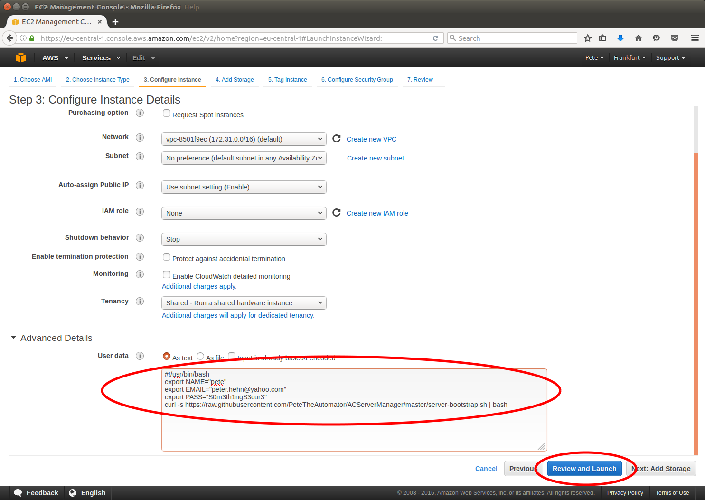

The next page displays a review of your selected options.  You'll notice a suggestion regarding "Security Groups" - these
are essentially firewall rules which you configure to permit access to certain network services.  AWS is rightfully very
security-conscious so by default only the bare minimum access is permitted to your server.  Assetto Corsa servers require
access to a small number of network services (via ports) which you'll configure in the next step.  Click the link marked
"Edit security groups".

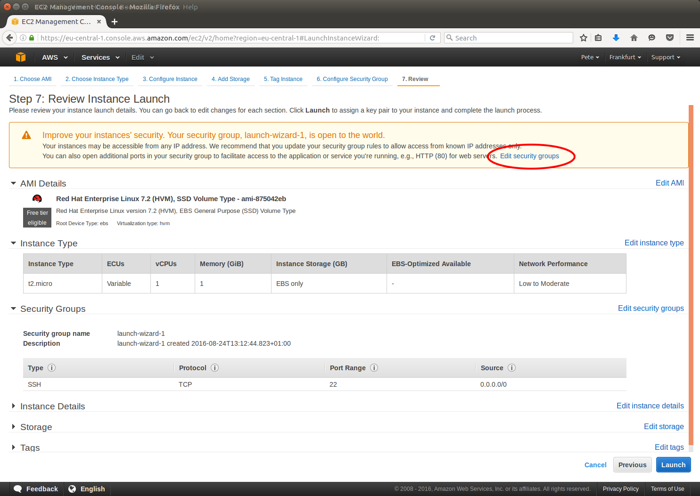

You'll see a page that allows you to define your new Security Group, which has the Name and Description fields pre-populated with
"launch-wizard" something-or-other.  Swap the name and description for something more meaningful like "assetto-corsa".

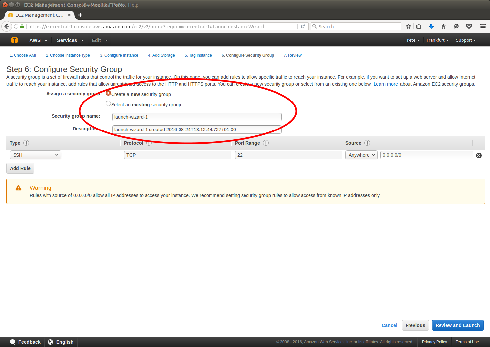

Continue to configure your new Security Group by adding rules which permit anyone access to the following network ports

* SSH (tcp/22) - anywhere
* HTTP (tcp/80) - anywhere
* Custom (tcp/9600) - anywhere
* Custom (**udp**/9600) - anywhere
* Custom (tcp/8081) - anywhere
* Custom (tcp/50041) - anywhere
* Custom (tcp/50042) - anywhere

Double check you've got those values correct before clicking the blue "Review and Launch" button.

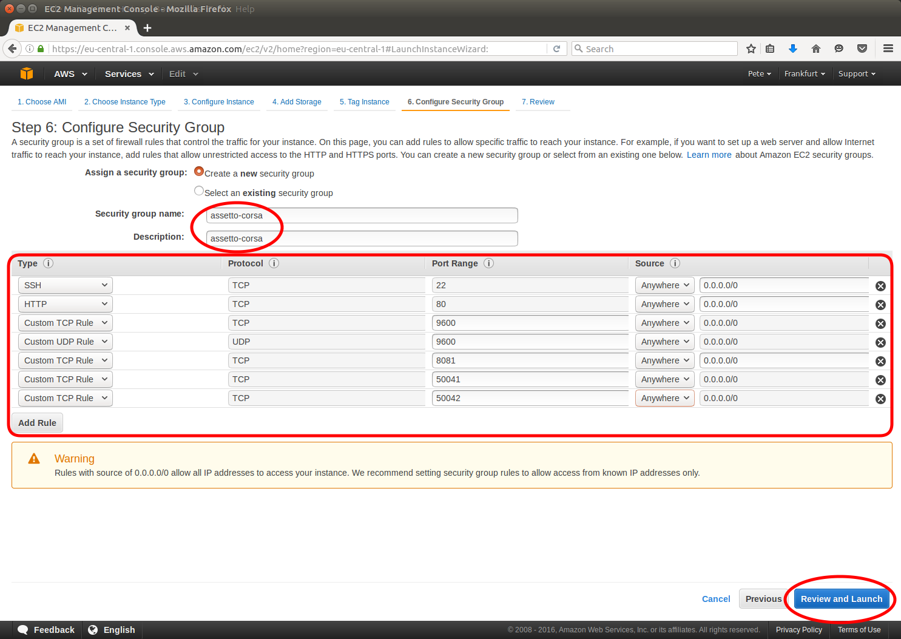

You'll be brought back to the Review page once again, and this time you should notice details of your Security Group have
been added.

Click the blue "Launch" button.

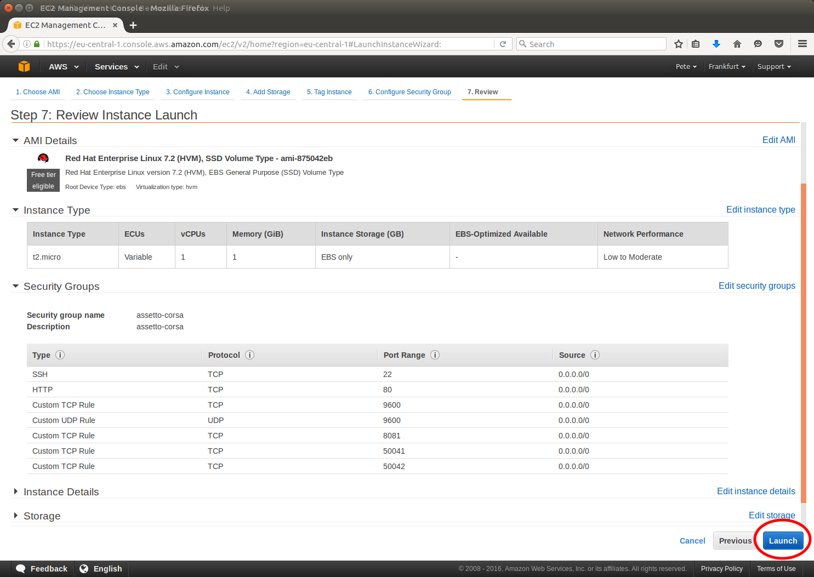

Now you should see a message about a Key Pair.  This is asking you to generate a unique key which only you can use to log-onto
your server using a terminal (via a program called SSH - which stands for Secure Shell).  It's wise to do this since any
future updates you may wish to apply to your Assetto Corsa server will come via this method.  SSH is a fundamental part of
Linux - think of it as Windows "Remote Desktop".

Choose the "Create a new key pair" option from the drop-down and name your key-pair something meaninful like
"assetto-corsa".  Then click the "Download Key Pair" button and keep the downloaded file somewhere safe.

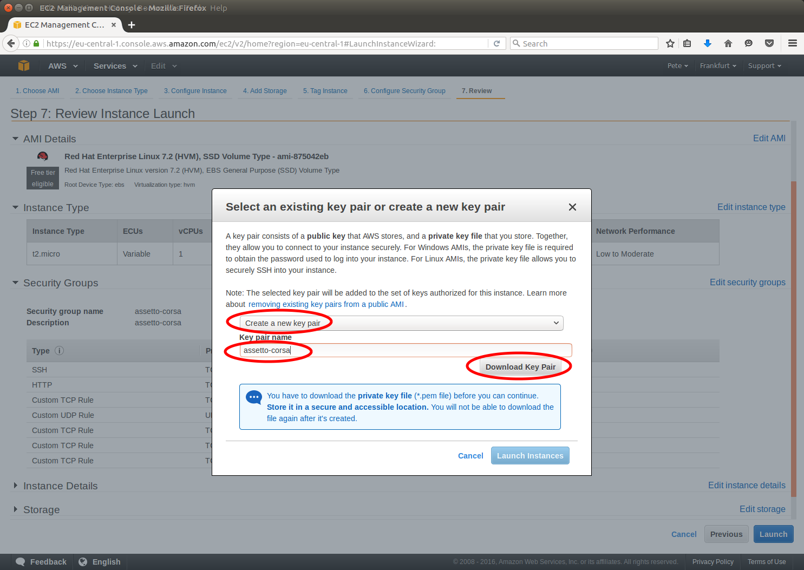

With your Key Pair downloaded, hit the blue Launch button and your EC2 Instance should now be launching.

Click on the blue "View Instances" button and you'll be able to check it's progress.

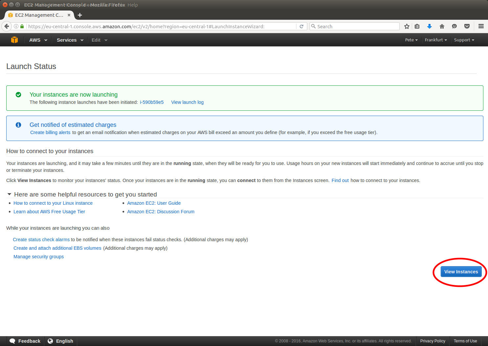

Here you can see it's state is "Pending" which means the EC2 Instance is being created, and hasn't begun booting yet.

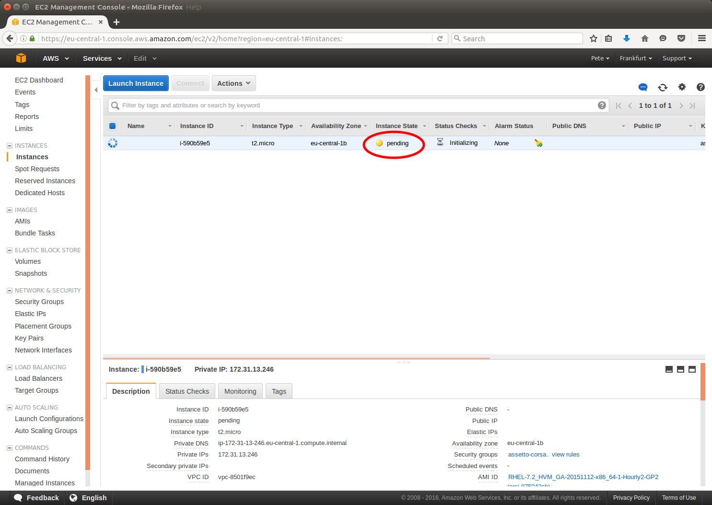

The state should turn to a green "Running" - at this stage the EC2 Instance has begun booting, and while Linux is very
quick to boot, the Bootstrap Script also needs to be executed before the Assetto Corsa Server Manager is
up-and-running.  Expect the whole process to take around 5 minutes from hitting the "Launch" button.

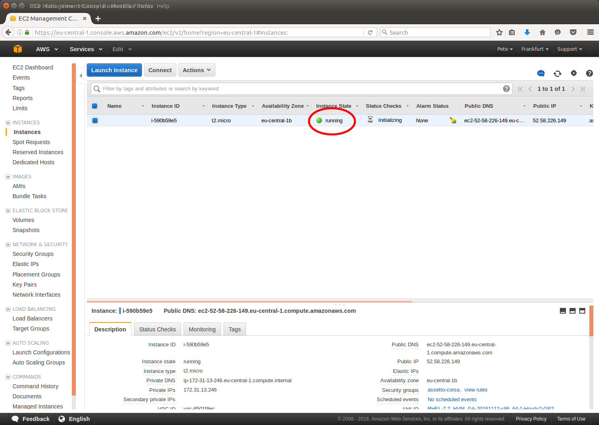

Also you may be wondering where to point your browser so you can log-in; the "Public IP" address can be found in the EC2
Instance details - copy that to your clipboard and paste it into your browser's url bar.

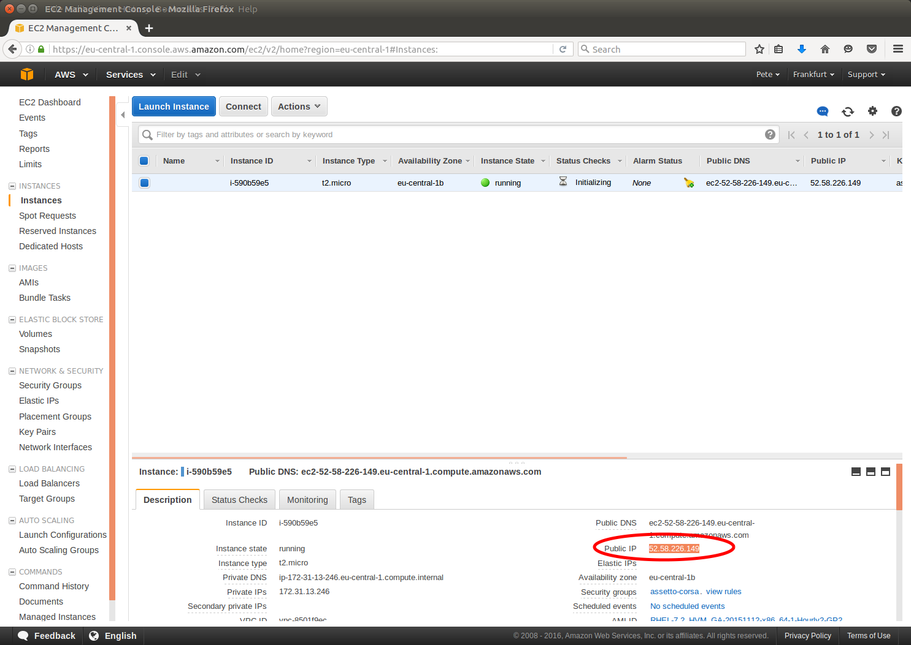

If everything went smoothly you should see a login screen (remember - give it around 5 minutes to get started).

Use the **NAME** and **PASS** values you set earlier to log in.

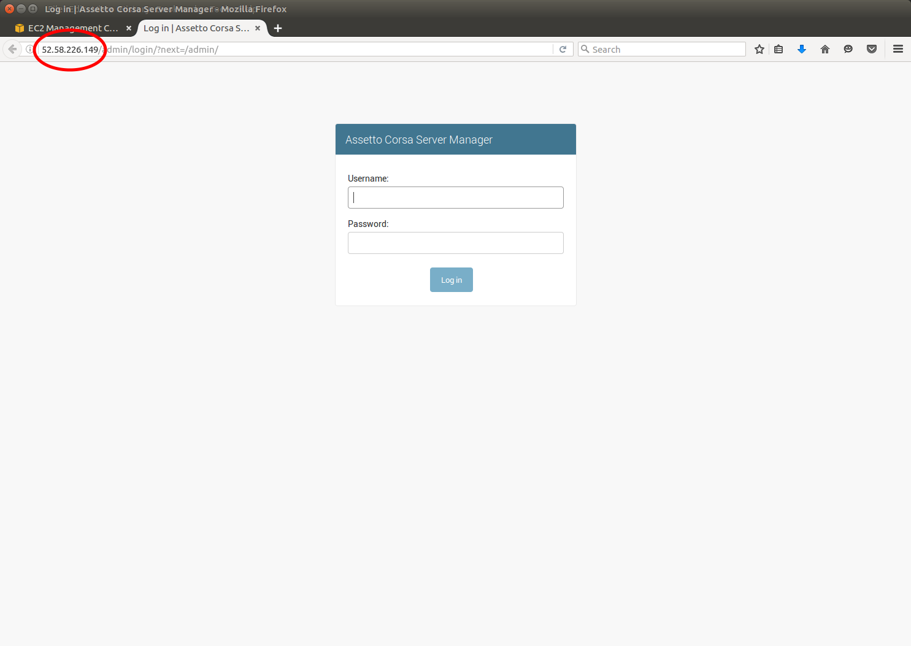

You should be presented with the super-user's view of the Assetto Corsa Server Manager web UI.

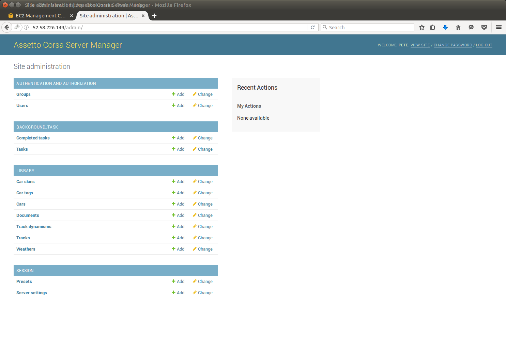

