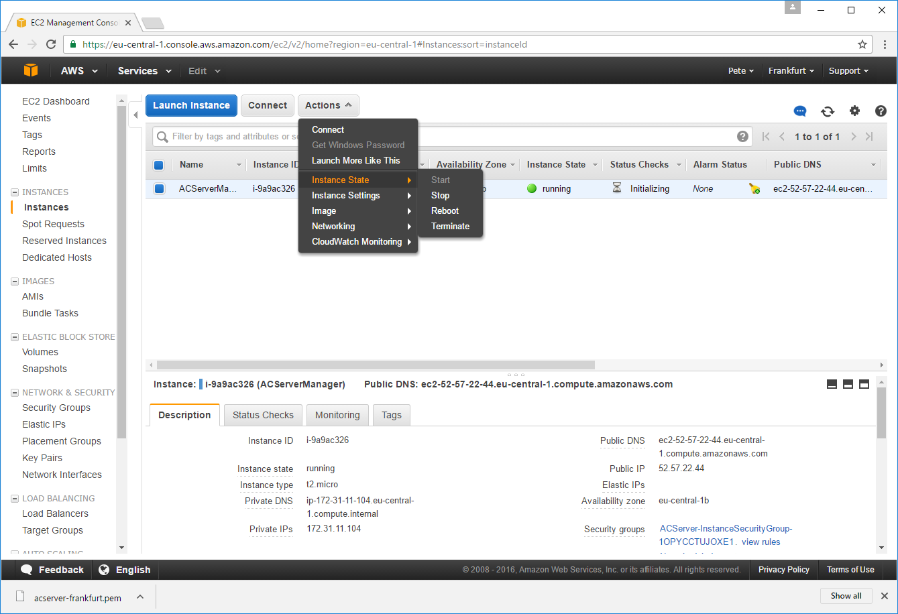

******************
Server Maintenance
******************
Details of the server's automated housekeeping tasks (log-rotation, security patches etc) will appear here, along with
instructions for triggering updates to the Assetto Corsa Server Manager.

Assetto Corsa Server Manager Updates
------------------------------------
The server owner can trigger a software update to the **latest stable** version of the Assetto Corsa Server Manager using the
method described below.  *Please note: this method is a short-term solution - a future goal is to provide a simple method that allows owners to apply a precise version of software update.*

First log into your Server's web interface and edit your url to read: http://**your-server-ip-address**/admin/upgrade/

**It appears nothing's happened** - except your browser immediately redirects you back to the main menu; this is expected.

Next log into the AWS web console and navigate to the **EC2** section to find your running Server Instance.  With your
instance selected, click the "Actions" button and mouse-over to "Instance State" and choose the "Reboot" option.  Confirm
you wish to reboot your instance and wait for a few minutes.

The server will reboot, and will fetch and apply the latest code from the master branch at this project's code
repository - it may take several minutes to apply the entire update.  After that time you should be able to log-in as
normal and your data should be intact.
